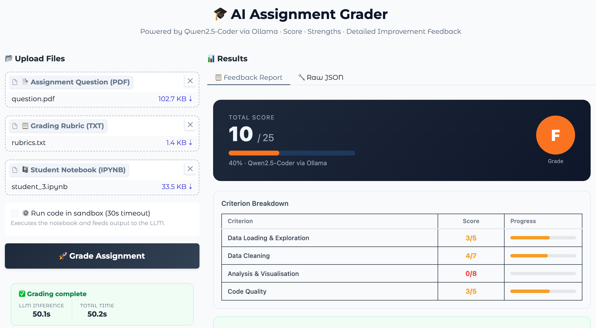

# 🎓 AI Assignment Grader

> **Grade student Jupyter notebooks in 60 seconds using a fully local LLM — no OpenAI, no API costs, no data leaves your machine.**

[](https://python.org)
[](https://ollama.com)
[](https://gradio.app)
[](https://huggingface.co/spaces)
[](https://docker.com)
[](LICENSE)

---

## 📸 Demo

[](https://youtu.be/mn-7UMb5nkE)

[](https://youtu.be/mn-7UMb5nkE)

🔗 **[Live Demo on HuggingFace Spaces](https://huggingface.co/spaces/sajilck/ai-assignment-grader)**

---

## 🧠 What It Does

Upload three files → get structured, rubric-aware feedback in under 90 seconds.

```
📄 Assignment PDF  +  📋 Rubric TXT  +  📓 Student IPYNB
                          ↓
              Qwen2.5-Coder:7b (via Ollama)
                          ↓
        ✅ Score out of 25
        ✅ Strengths  (with actual code references)
        ✅ Areas to Improve  (rubric violation → exact mistake → why → fix)
```

Each improvement card shows:
- 🔴 The **exact rubric rule** that was violated (dark banner)
- 🔍 **What** the student did wrong or missed
- ⚠️ **Why it matters** (consequence — leakage, wrong output, etc.)
- 🛠️ **How to fix it** — with a corrected code snippet

---

## ✨ Key Features

| Feature | Detail |
|---|---|
| **100% Local LLM** | Qwen2.5-Coder:7b via Ollama — student data never leaves the machine |
| **Rubric-aware grading** | Model cross-checks every penalty rule line by line |
| **Score integrity** | Per-criterion caps + hard cap at 25 enforced in Python — LLM cannot inflate scores |
| **Code sandbox** | Optionally executes student notebook in a subprocess and feeds output to LLM as evidence |
| **Live inference timer** | Background thread runs LLM; generator yields 1s ticks to Gradio — real-time elapsed display |
| **Structured JSON output** | Typed schema with `criterion_scores`, `strengths`, `areas_to_improve[{category, rubric_requirement, issue, why_it_matters, fix}]` |
| **Docker deployment** | One-command deploy to HuggingFace Spaces |
| **CI/CD** | GitHub Actions auto-syncs to HF Spaces on every push to `main` |

---

## 🏗️ Architecture

```
┌─────────────────────────────────────────────────┐
│                  Gradio Frontend                │
│   Upload PDF · Rubric · IPYNB → Grade Button   │
└──────────────────┬──────────────────────────────┘
                   │
┌──────────────────▼──────────────────────────────┐
│              Grading Pipeline                   │
│                                                 │
│  extract_pdf_text()  →  PyMuPDF                 │
│  extract_notebook_code()  →  nbformat           │
│  run_code_sandbox()  →  subprocess (optional)   │
│                                                 │
│  build_user_prompt()  →  structured prompt      │
│  call_ollama()  →  background thread            │
│                    + 1s timer ticks             │
└──────────────────┬──────────────────────────────┘
                   │
┌──────────────────▼──────────────────────────────┐
│         Ollama  ·  Qwen2.5-Coder:7b            │
│         localhost:11434  ·  format=json         │
│         temperature=0.0  ·  num_ctx=4096        │
└──────────────────┬──────────────────────────────┘
                   │
┌──────────────────▼──────────────────────────────┐
│           Python Score Guard                    │
│   clamp each criterion to its rubric max        │
│   hard cap total at 25                          │
└──────────────────┬──────────────────────────────┘
                   │
┌──────────────────▼──────────────────────────────┐
│         render_html_report()                    │
│   Score header · Criterion table               │
│   Strengths · Improvement cards with RUBRIC    │
│   banner · LLM time · Total time               │
└─────────────────────────────────────────────────┘
```

---

## 🚀 Quick Start

### Option 1 — Google Colab (recommended, zero setup)

1. Open `AI_Grader_Complete_v2.ipynb` in Google Colab
2. Set runtime to **T4 GPU** (Runtime → Change runtime type)
3. Run all cells (`Ctrl+F9`)
4. The Gradio UI appears at the bottom — upload your files and grade

[](https://colab.research.google.com/github/cksajil/ai-assignment-grader/blob/main/AI_Grader_Complete_v2.ipynb)

### Option 2 — Run locally

```bash
# 1. Install Ollama
curl -fsSL https://ollama.com/install.sh | sh

# 2. Pull the model
ollama pull qwen2.5-coder:7b

# 3. Clone and install
git clone https://github.com/cksajil/ai-assignment-grader.git
cd ai-assignment-grader
pip install -r requirements.txt

# 4. Run
python app.py
# Open http://localhost:7860
```

### Option 3 — Docker

```bash
docker build -t ai-assignment-grader .
docker run -p 7860:7860 ai-assignment-grader
```

---

## 📁 Repository Structure

```
ai-assignment-grader/
│
├── 📓 AI_Grader_Complete_v2.ipynb   # Full self-contained Colab notebook
├── 🐍 app.py                         # Gradio app (HF Spaces entry point)
├── 🐳 Dockerfile                     # Docker Space config
├── 📜 start.sh                       # Ollama serve → pull → warmup → launch
├── 📦 requirements.txt
│
├── sample_data/
│   ├── rubric_template.txt           # Rubric format with penalty rules
│   └── sample_submission.ipynb       # Example student notebook for testing
│
├── assets/
│   └── demo.gif                      # Demo animation for README
│
└── .github/
    └── workflows/
        └── sync_to_hf.yml            # Auto-deploy to HuggingFace Spaces
```

---

## 📋 Rubric Format

The rubric format is the most important input — specific penalty rules produce specific feedback.

```
ASSIGNMENT RUBRIC — [Title]
Total: 25 points

── CRITERION 1: Data Loading & Exploration  [5 pts] ──
Full marks: Loads dataset, displays shape, dtypes, null counts, summary stats.
Penalise:
  - No .info() or .describe() called (-2)
  - Shape not checked (-1)
  - Null counts not inspected (-2)

── CRITERION 2: Data Cleaning  [7 pts] ──
Full marks: Handles nulls correctly, removes duplicates, no data leakage.
Penalise:
  - fillna(0) on continuous columns (-3) — use median/mean
  - Duplicates not removed (-2)
  - Cleaning AFTER train/test split — leakage (-3)
```

See [`sample_data/rubric_template.txt`](sample_data/rubric_template.txt) for the full template.

**Rule:** the more explicit the penalty rules, the more surgical the feedback.

---

## ⚙️ Configuration

| Parameter | Default | Effect |
|---|---|---|
| `MODEL_NAME` | `qwen2.5-coder:7b` | Change to `3b` for 2–3× faster CPU inference |
| `MAX_CODE_LEN` | `3500` chars | Truncation limit for student code |
| `temperature` | `0.0` | Deterministic scoring — no randomness |
| `num_ctx` | `4096` | Context window — enough for rubric + code |
| `num_thread` | `4` | Match to your CPU core count |
| `OLLAMA_KEEP_ALIVE` | `-1` | Model stays in RAM permanently |

---

## 🐳 Deploy to HuggingFace Spaces

```bash
# 1. Create a Docker Space at huggingface.co/new-space (SDK: Docker)

# 2. Push
git remote add hf https://huggingface.co/spaces/YOUR_USERNAME/ai-assignment-grader
git push hf main

# Auto-deploy on every git push (after setting HF_TOKEN secret in GitHub):
# .github/workflows/sync_to_hf.yml handles this automatically
```

**Hardware recommendations:**

| Tier | Cost | Grading speed |
|---|---|---|
| CPU Basic (free) | $0 | ~3–5 min/submission |
| CPU Upgrade | $0.03/hr | ~60–90 sec/submission |
| T4 Small GPU | $0.60/hr | ~30–45 sec/submission |

---

## 🛠️ Tech Stack

| Component | Technology |
|---|---|
| LLM | Qwen2.5-Coder:7b (GGUF Q4_K_M via Ollama) |
| Frontend | Gradio 4.0+ |
| PDF parsing | PyMuPDF (fitz) |
| Notebook parsing | nbformat |
| Retry logic | Tenacity |
| Inference | Ollama REST API (`/api/chat`, `format=json`) |
| Containerisation | Docker |
| Deployment | HuggingFace Spaces (Docker SDK) |
| CI/CD | GitHub Actions |

---

## 💡 Design Decisions

**Why local LLM over GPT-4?**
Student code is sensitive data. Running inference locally means zero data leaves the machine — important for institutions with privacy requirements.

**Why `temperature=0.0`?**
Grading requires consistency, not creativity. Zero temperature makes scores deterministic and repeatable.

**Why Python-side score clamping?**
LLMs can hallucinate inflated totals even with clear instructions. The Python guard clamps each criterion to its rubric maximum and hard-caps the total at 25 regardless of what the model returns.

**Why a background thread for the LLM call?**
Gradio generators must keep yielding to stream UI updates. Running `call_ollama()` in a `threading.Thread` lets the generator tick the live timer every second while inference runs, without blocking.

---

## 📄 License

MIT License — see [LICENSE](LICENSE)

---

## 🙋 Author

**Sajil C. K.**
ML Engineer & Educator · ICT Academy of Kerala

[](https://github.com/cksajil)
[](https://linkedin.com/in/sajilck)
[](https://huggingface.co/sajilck)
[](https://intuitivetutorial.com)
